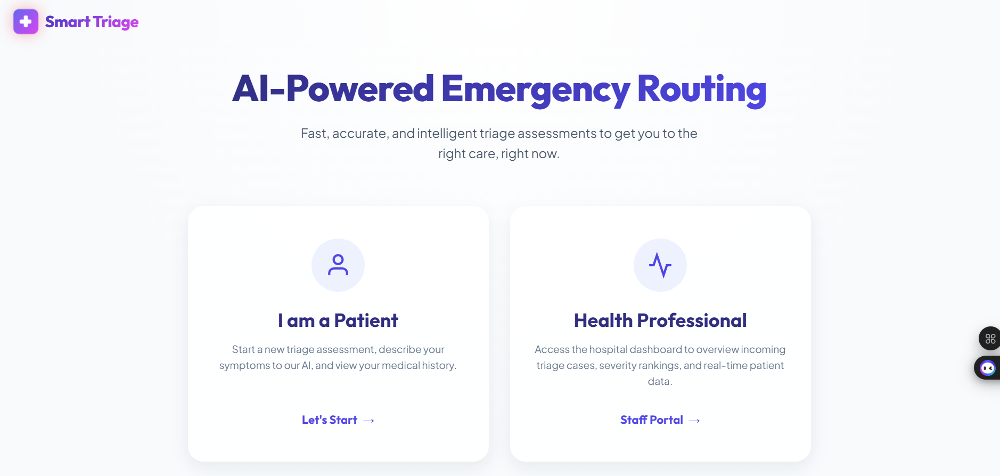

  

Smart Triage – Symptom Priority Tool 🏥🎯
Basic Details
Team Name: Smart Triage

Member :Emiya Varghese - Viswajyothi College of Engineering and Technology

Hosted Project Link

https://triage-smart.onrender.com

Project Description

Smart Triage is a Flask-based web application that simulates a digital emergency room triage system. It collects patient details, analyzes symptoms and severity levels, and classifies cases into High, Medium, or Low priority with appropriate medical guidance.

The system provides a clean, hospital-themed interface and consultant-like reassurance — all built using Flask, HTML, and CSS (no database).

The Problem Statement

In crowded emergency rooms, patients often wait in a single queue regardless of the severity of their condition. Nurses and staff are overwhelmed, and critical patients may not always be prioritized quickly.

There is a need for a simple, accessible digital triage system that can:

Collect patient intake information

Evaluate severity and symptoms

Provide instant priority classification

Offer clear safety guidance

The Solution

Smart Triage solves this problem by:

Collecting structured patient information through a full intake form

Combining severity levels and multiple symptoms

Using rule-based triage logic to determine priority

Displaying color-coded results (Red / Orange / Green)

Providing consultant-style safety instructions

Showing a clear summary of patient details and next steps

All implemented using beginner-friendly Flask logic and clean HTML/CSS.

Technical Details
Technologies/Components Used
For Software:

Languages used: Python, HTML5, CSS3

Frameworks used: Flask

Libraries used: Jinja2 (Flask templating)

Tools used: VS Code, Git, GitHub

Features

Feature 1: Full Patient Intake Form

Name

Age

Contact Number

Severity Level (Mild / Moderate / Severe)

Multi-select Symptoms

Detailed Condition Description

Feature 2: Smarter Triage Logic

Combines severity + symptoms

Classifies into:

🔴 High Priority

🟠 Medium Priority

🟢 Low Priority

Feature 3: Dynamic Medical Guidance

High Priority → “Seek immediate medical attention.”

Medium Priority → “Consult a doctor within 24 hours.”

Low Priority → “Stay hydrated and monitor symptoms.”

Feature 4: Modern Hospital-Themed UI

Card-based layout

Responsive design

Clean typography

Color-coded results

Professional reassurance messaging

Feature 5: Confirmation & Summary Section

Displays patient details

Shows final triage classification

Displays recommended next steps

Implementation
For Software:
Installation
# Clone the repository
git clone https://github.com/yourusername/smart-triage.git

# Navigate into project folder
cd smart-triage

# Install dependencies
pip install flask
Run
python app.py

Then open:

http://127.0.0.1:5000/
Project Documentation
For Software:
Screenshots (Add at least 3)

  

  

  

Patient Intake Form – Collects personal details, severity, and symptoms

High Priority Result – Red themed alert with emergency instructions

Patient Summary Section – Displays final classification and next steps

Diagrams
System Architecture:

Explanation:

User → HTML Form → Flask Backend →
Triage Logic (if/else rules) →
Priority Classification →
Rendered Result Page (Color-coded UI)

Application Workflow:

Workflow Steps:

User fills patient intake form

Data submitted via POST request

Flask processes inputs

Severity + symptoms evaluated

Priority assigned

Instructions generated

Result page displayed

Additional Documentation
For Web Projects with Backend:
API Documentation

Base URL: http://127.0.0.1:5000

Endpoints
GET /

Description: Loads the patient intake form

Response: HTML page

POST /triage

Description: Processes patient form data and calculates priority

Request Body (Form Data):

{
  "name": "John Doe",
  "age": 22,
  "contact": "9876543210",
  "severity": "Severe",
  "symptoms": ["Chest Pain", "Breathing Difficulty"],
  "description": "Sudden chest tightness for 30 minutes"
}

Response:

{
  "priority": "High",
  "message": "Seek immediate medical attention.",
  "color": "Red"
}
Project Demo
Video

https://drive.google.com/file/d/1fBdX1H7tU5uGOliwBvLPUz9NtGBR7tSJ/view?usp=sharing
Video Demonstrates:

Filling intake form

Submitting multi-symptom selection

High / Medium / Low classification

UI responsiveness

Safety instruction generation

AI Tools Used (Transparency Section)

Tool Used: ChatGPT

Purpose:

UI structure suggestions

Flask logic improvements

README documentation drafting

Code optimization guidance

Key Prompts Used:

“Create rule-based triage logic in Flask”

“Design hospital-themed UI using HTML and CSS”

“Improve patient intake interface for emergency system”

Percentage of AI-generated code: ~30–40% (UI suggestions and structure)

Human Contributions:

Full architecture planning

Business logic implementation

Triage classification rules

UI styling decisions

Testing and debugging

Team Contributions

[Your Name]: Backend logic, Flask routing, triage algorithm

[Teammate Name]: UI design, CSS styling, testing & documentation

License

This project is licensed under the MIT License – see the LICENSE file for details.

Made with ❤️ for smarter emergency care systems 🚑
